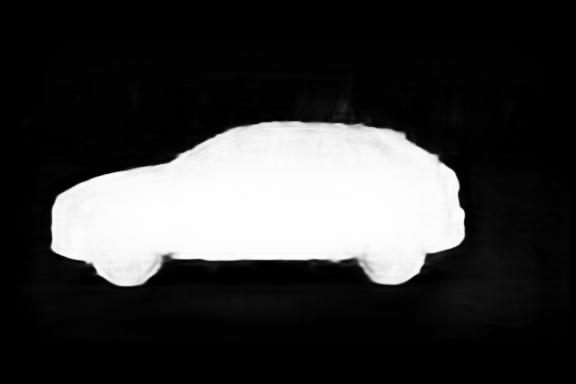
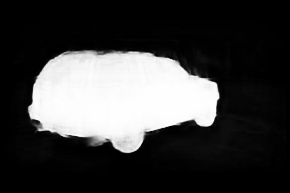
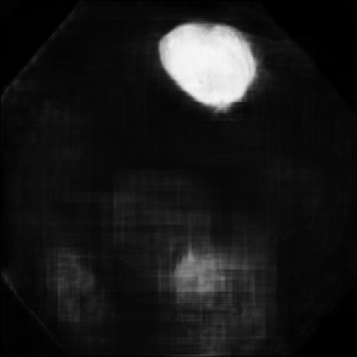
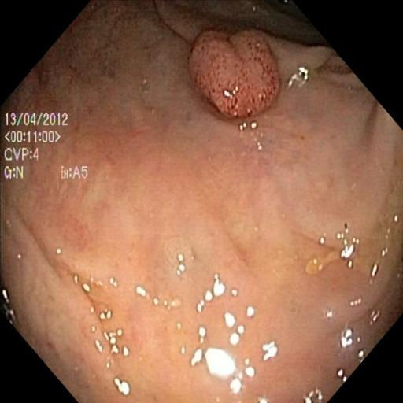
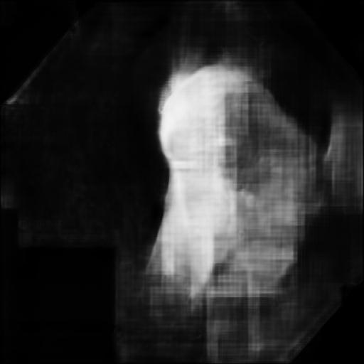
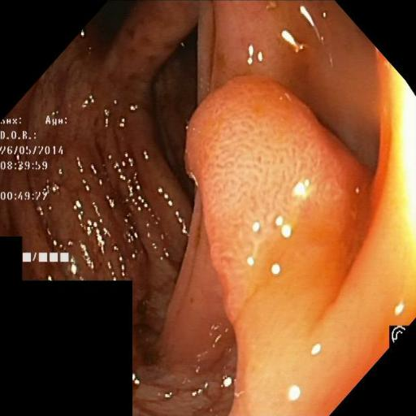

# UNet
This is my first of many experiments in implementating papers. Like the title suggest, this is a Tensorflow implementation of the [Unet](https://arxiv.org/pdf/1505.04597.pdf) Paper.
At the same time it serves as a playground for different experiments and implementation techniques.

## Results
The model was tested with two datasets.
### [Caravan](https://www.kaggle.com/competitions/carvana-image-masking-challenge/data)

### [Kvasir-SEG](https://datasets.simula.no/kvasir-seg/)

